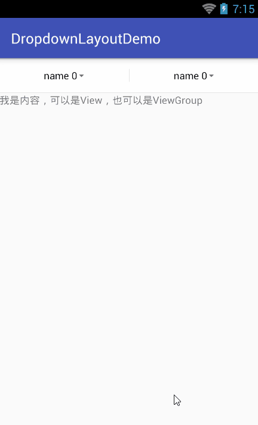
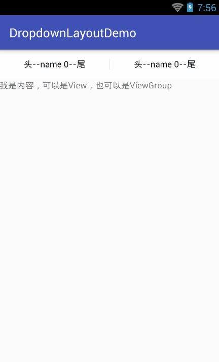

# DropdownLayoutDemo
下拉导航菜单，使用非常简单

###该项目基于[FilterDropDownMenu-master](http://https://github.com/leerduo/FilterDropDownMenu)项目进行封装,并增加更多效果（如：选中时条目的背景及旁边的图标都可自定义）,使用时仅仅只要2个步骤：
####1、设置布局

	<?xml version="1.0" encoding="utf-8"?>
	<RelativeLayout
	    xmlns:android="http://schemas.android.com/apk/res/android"
	    xmlns:app="http://schemas.android.com/apk/res-auto"
	    xmlns:tools="http://schemas.android.com/tools"
	    android:id="@+id/activity_main"
	    android:layout_width="match_parent"
	    android:layout_height="match_parent"
	    tools:context="com.lqr.dropdownlayoutdemo.MainActivity">
	
	    <com.lqr.dropdownlayoutdemo.views.DropdownLayout
	        android:id="@+id/dl"
	        android:layout_width="match_parent"
	        android:layout_height="match_parent"
	        app:ddl_item_selected__drawable="@mipmap/ic_task_status_list_check"
	        app:ddl_item_text_gravity="left"
	        app:ddl_list_max_height="250dp"
	        app:ddl_top_btn_noraml_drawable="@mipmap/ic_dropdown_normal"
	        app:ddl_top_btn_selected_drawable="@mipmap/ic_dropdown_actived"/>
	
	</RelativeLayout>

####2、代码控制
	public class MainActivity extends AppCompatActivity {

    private DropdownLayout mDl;

    @Override
    protected void onCreate(Bundle savedInstanceState) {
        super.onCreate(savedInstanceState);
        setContentView(R.layout.activity_main);
        mDl = (DropdownLayout) findViewById(R.id.dl);
        mDl.setCols(2);

        //创建内容区
        TextView tv = new TextView(this);
        tv.setText("我是内容，可以是View，也可以是ViewGroup");

        //创建下拉列表数据
        final List<Map<String, String>> listData = new ArrayList<>();
        for (int i = 0; i < mDl.getCols(); i++) {
			//这里使用LinkedHashMap是为了让下拉列表的条目有序
            Map<String, String> map = new LinkedHashMap<>();
            for (int j = 0; j < 6; j++) {
                map.put("name " + j, "value " + j);
            }
            listData.add(map);
        }

        mDl.init(tv, listData);
        mDl.setOnDropdownListChecked(new DropdownLayout.OnDropdownListChecked() {
            @Override
            public void onDropdownListChecked(int indexOfButton, int indexOfList, String textOfList, String valueOfList) {
                
            }
        });
    }
}

除此之外，还可以设置为选中项不在下拉列表中显示，可以给下拉按钮文字设置前缀和后缀

	<com.lqr.dropdownlayoutdemo.views.DropdownLayout
        android:id="@+id/dl"
        android:layout_width="match_parent"
        android:layout_height="match_parent"
        app:ddl_only_show_one="true"
        app:ddl_top_btn_text_prefix="头--"
        app:ddl_top_btn_text_suffix="--尾"
        />

以下是自定义的属性，用于xml布局，绝大程度地订制整个下拉控件：
	<resources>
	    <declare-styleable name="DropdownLayout">
	        <!--下拉列表的列数-->
	        <attr name="ddl_cols" format="integer"/>
	        <!--下拉按钮与下拉列表中只显示一个，如果在下拉列表中选择了item5，则item5消失，下拉按钮显示item5的name-->
	        <attr name="ddl_only_show_one" format="boolean"/>
	        
	        <!--下拉按钮区背景-->
	        <attr name="ddl_top_bg" format="color"/>
	        <!--下拉按钮区的高度-->
	        <attr name="ddl_top_height" format="dimension"/>
	        <!--下拉按钮区的分割线颜色-->
	        <attr name="ddl_top_split_line_color" format="color"/>
	        <!--下拉按钮区的分割线宽度-->
	        <attr name="ddl_top_split_line_width" format="dimension"/>
	        <!--下拉按钮区的分割线高度-->
	        <attr name="ddl_top_split_line_height" format="dimension"/>
	
	        <!--下拉按钮文本前缀-->
	        <attr name="ddl_top_btn_text_prefix" format="string"/>
	        <!--下拉按钮文本后缀-->
	        <attr name="ddl_top_btn_text_suffix" format="string"/>
	        <!--下拉按钮文字大小-->
	        <attr name="ddl_top_btn_text_size" format="dimension"/>
	        <!--下拉按钮未选中时文字颜色-->
	        <attr name="ddl_top_btn_text_normal_color" format="color"/>
	        <!--下拉按钮选中时文字颜色-->
	        <attr name="ddl_top_btn_text_selected_color" format="color"/>
	        <!--下拉按钮文字未选中时显示的图标-->
	        <attr name="ddl_top_btn_selected_drawable" format="reference"/>
	        <!--下拉按钮文字选中时显示的图标-->
	        <attr name="ddl_top_btn_noraml_drawable" format="reference"/>
	
	        <!--下划线宽度-->
	        <attr name="ddl_top_bottom_line_width" format="dimension"/>
	        <!--下划线高度-->
	        <attr name="ddl_top_bottom_line_height" format="dimension"/>
	        <!--下划线颜色-->
	        <attr name="ddl_top_bottom_line_color" format="color"/>
	
	        <!--分割线颜色-->
	        <attr name="ddl_split_line_color" format="color"/>
	        <!--分割线宽度-->
	        <attr name="ddl_split_line_width" format="dimension"/>
	        <!--分割线高度-->
	        <attr name="ddl_split_line_height" format="dimension"/>
	
	        <!--遮盖层颜色-->
	        <attr name="ddl_mask_bg" format="color"/>
	
	        <!--下拉列表的最大高度-->
	        <attr name="ddl_list_max_height" format="dimension"/>
	
	        <!--下拉列表item的左内间距-->
	        <attr name="ddl_item_padding_left" format="dimension"/>
	        <!--下拉列表item的右内间距-->
	        <attr name="ddl_item_padding_right" format="dimension"/>
	        <!--下拉列表item的高度-->
	        <attr name="ddl_item_height" format="dimension"/>
	        <!--下拉列表item文字大小-->
	        <attr name="ddl_item_text_size" format="dimension"/>
	        <!--下拉列表item未选中时文字颜色-->
	        <attr name="ddl_item_text_normal_color" format="color"/>
	        <!--下拉列表item选中时文字颜色-->
	        <attr name="ddl_item_text_selected_color" format="color"/>
	        <!--下拉列表item未选中时背景颜色-->
	        <attr name="ddl_item_normal_bg" format="color"/>
	        <!--下拉列表item选中时背景颜色-->
	        <attr name="ddl_item_selected_bg" format="color"/>
	        <!--下拉列表item未选中图标-->
	        <attr name="ddl_item_normal_drawable" format="reference"/>
	        <!--下拉列表item选中图标-->
	        <attr name="ddl_item_selected__drawable" format="reference"/>
	        <!--下拉列表item的文字位置-->
	        <attr name="ddl_item_text_gravity">
	            <enum name="center" value="0"></enum>
	            <enum name="left" value="1"></enum>
	            <enum name="right" value="2"></enum>
	        </attr>
	
	        <!--下拉列表item下划线高度-->
	        <attr name="ddl_item_bottom_line_height" format="dimension"/>
	        <!--下拉列表item下划线左边距-->
	        <attr name="ddl_item_bottom_line_margin_left" format="dimension"/>
	        <!--下拉列表item下划线右边距-->
	        <attr name="ddl_item_bottom_line_margin_right" format="dimension"/>
	        <!--下拉列表item下划线颜色-->
	        <attr name="ddl_item_bottom_line_color" format="color"/>
	
	
	    </declare-styleable>
	</resources>

注意：目前级联还有些小问题（如：第二列选择了第二个，在第一列更新需要级联的数据时，第二列仍然选中第二个），之后有时间会解决，如果不使用级联，目前项目非常好用。

